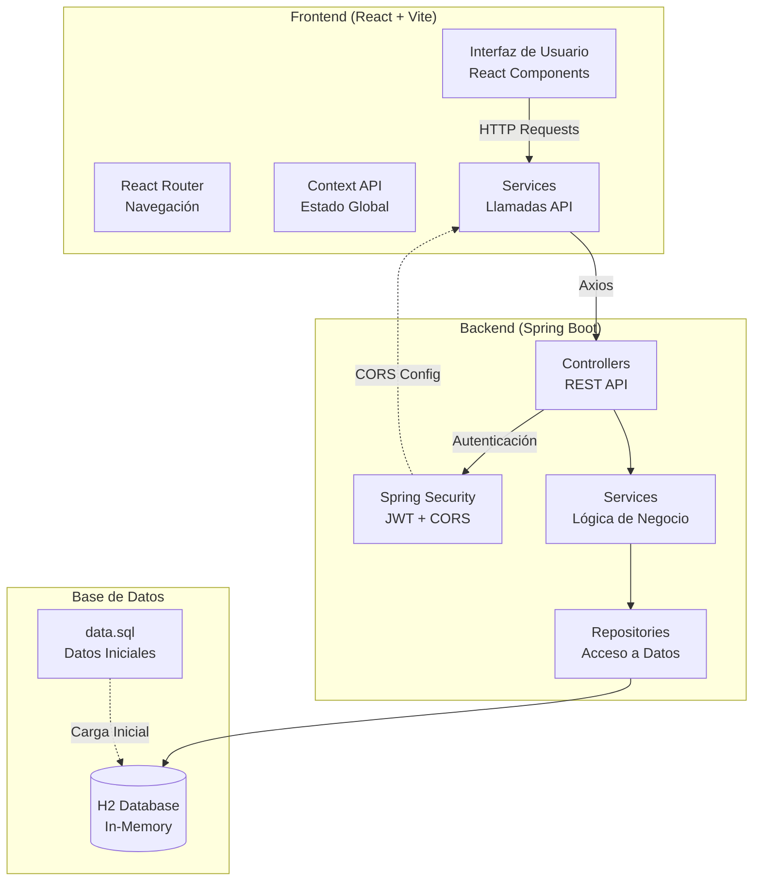
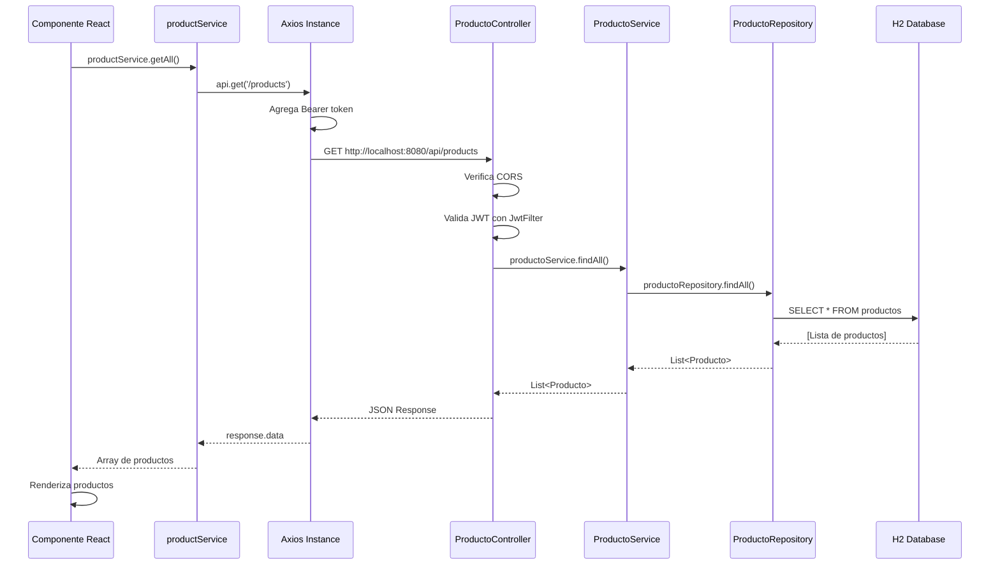
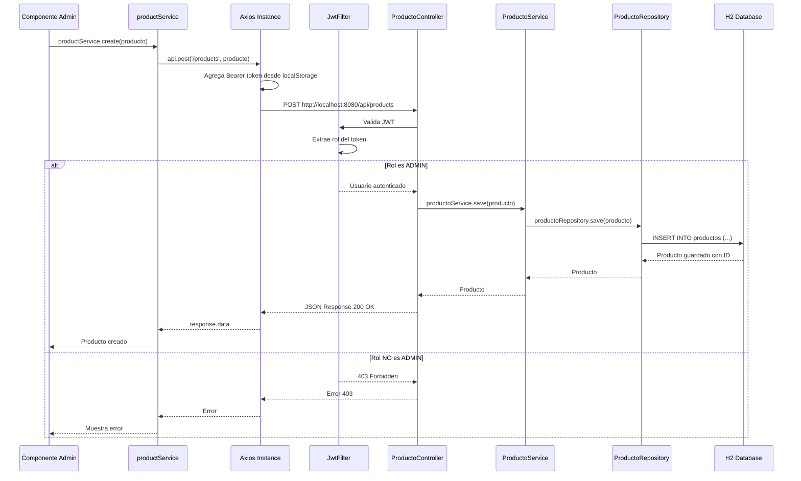
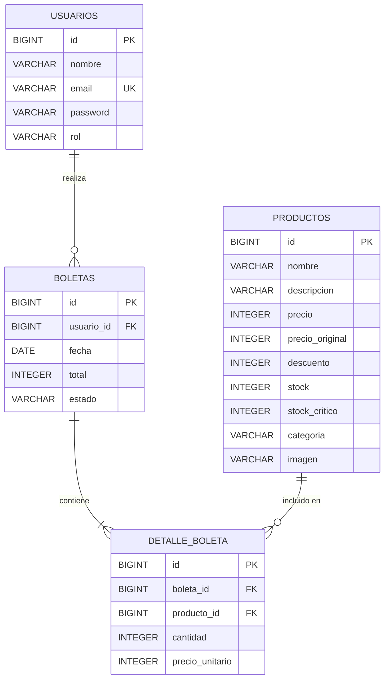

# Documentación Completa - Proyecto GamerZone Fullstack

## 📋 Resumen Global del Proyecto

**GamerZone** es una aplicación web fullstack de e-commerce para la venta de productos gaming. El proyecto implementa una arquitectura moderna separando el frontend y backend, con autenticación JWT, gestión de productos, carrito de compras y un panel de administración.

### 🎯 Características Principales

- ✅ Catálogo de productos gaming con sistema de descuentos
- ✅ Autenticación y registro de usuarios con JWT
- ✅ Panel de administración para gestión de productos (CRUD completo)
- ✅ Carrito de compras con persistencia
- ✅ Sistema de roles (ADMIN/CLIENTE)
- ✅ Base de datos H2 en memoria con datos precargados
- ✅ Seguridad con Spring Security y BCrypt
- ✅ Suite de tests unitarios con Karma/Jasmine (45+ casos de prueba)

---

## 🏗️ Arquitectura del Proyecto



### 📊 Stack Tecnológico

#### **Backend**
- **Framework**: Spring Boot 3.2.3
- **Lenguaje**: Java 17
- **ORM**: Spring Data JPA / Hibernate
- **Seguridad**: Spring Security + JWT (jjwt 0.11.5)
- **Base de Datos**: H2 Database (In-Memory)
- **Build Tool**: Maven
- **Utilidades**: Lombok (reducción de boilerplate)

#### **Frontend**
- **Framework**: React 18.2.0
- **Build Tool**: Vite 4.4.9
- **Routing**: React Router DOM 6.26.0
- **HTTP Client**: Axios 1.13.2
- **UI Framework**: Bootstrap 5.3.3
- **Testing**: Karma + Jasmine + Testing Library

---

## 🔗 Conexión Frontend-Backend-Base de Datos

### 1️⃣ Configuración de la Base de Datos (H2)

#### **application.properties**
```properties
# H2 Database Configuration
spring.datasource.url=jdbc:h2:mem:gamerzonedb
spring.datasource.driverClassName=org.h2.Driver
spring.datasource.username=sa
spring.datasource.password=password
spring.jpa.database-platform=org.hibernate.dialect.H2Dialect
spring.h2.console.enabled=true

# JPA Configuration
spring.jpa.hibernate.ddl-auto=update
spring.jpa.show-sql=true
spring.jpa.defer-datasource-initialization=true
```

**🔍 Explicación:**
- **Base de datos en memoria**: H2 se ejecuta completamente en RAM, ideal para desarrollo y testing
- **`ddl-auto=update`**: Hibernate genera/actualiza automáticamente las tablas basándose en las entidades JPA
- **`defer-datasource-initialization=true`**: Permite que Hibernate cree las tablas ANTES de ejecutar `data.sql`
- **Console H2**: Accesible en `http://localhost:8080/h2-console` para inspeccionar la base de datos

#### **Inicialización de Datos (data.sql)**

El archivo [data.sql](file:///C:/Users/Rodrigo/Desktop/Fullstack_II_v2/backend/src/main/resources/data.sql) contiene:

```sql
-- Usuarios precargados (Password: 123456 con BCrypt)
INSERT INTO usuarios (nombre, email, password, rol) VALUES 
  ('Admin User', 'admin@admin.cl', '$2a$10$N.zmdr9k7uOCQb376NoUnuTJ8iAt6Z5EHsM8lE9lBOcd7.M.TjK8K', 'ADMIN'),
  ('Cliente User', 'cliente@gamerzone.cl', '$2a$10$N.zmdr9k7uOCQb376NoUnuTJ8iAt6Z5EHsM8lE9lBOcd7.M.TjK8K', 'CLIENTE');

-- Productos iniciales
INSERT INTO productos (nombre, descripcion, precio, precio_original, descuento, stock, stock_critico, categoria, imagen) VALUES 
  ('Mouse Gamer RGB', 'Mouse con sensor óptico...', 25000, 35000, 28, 50, 5, 'Periféricos', 'https://...'),
  ('Teclado Mecánico', 'Teclado mecánico...', 45000, 60000, 25, 30, 3, 'Periféricos', 'https://...'),
  ...
```

**🔍 Explicación:**
- Se cargan **2 usuarios** con contraseñas encriptadas con BCrypt
- Se insertan **5 productos** con información completa (precios, stock, imágenes)
- Este script se ejecuta AUTOMÁTICAMENTE al iniciar el backend

---

### 2️⃣ Capa de Modelo (Entidades JPA)

#### **Entidad Producto**

Archivo: [Producto.java](file:///C:/Users/Rodrigo/Desktop/Fullstack_II_v2/backend/src/main/java/com/gamerzone/backend/model/Producto.java#L1-L28)

```java
@Data
@Entity
@Table(name = "productos")
public class Producto {
    @Id
    @GeneratedValue(strategy = GenerationType.IDENTITY)
    private Long id;
    
    @Column(nullable = false)
    private String nombre;
    
    @Column(length = 1000)
    private String descripcion;
    
    private Integer precio;
    private Integer precioOriginal;
    private Integer descuento;
    private Integer stock;
    private Integer stockCritico;
    private String categoria;
    private String imagen;
}
```

**🔍 Características JPA:**
- **`@Entity`**: Marca la clase como una entidad JPA que será mapeada a una tabla
- **`@Table(name = "productos")`**: Define el nombre de la tabla en la base de datos
- **`@Id` + `@GeneratedValue`**: Define la clave primaria con autoincremento
- **`@Data` (Lombok)**: Genera automáticamente getters, setters, toString, equals y hashCode

#### **Entidad Usuario**

Archivo: [Usuario.java](file:///C:/Users/Rodrigo/Desktop/Fullstack_II_v2/backend/src/main/java/com/gamerzone/backend/model/Usuario.java#L1-L26)

```java
@Data
@Entity
@Table(name = "usuarios")
public class Usuario {
    @Id
    @GeneratedValue(strategy = GenerationType.IDENTITY)
    private Long id;
    
    @Column(nullable = false)
    private String nombre;
    
    @Column(unique = true, nullable = false)
    private String email;
    
    @Column(nullable = false)
    private String password;
    
    @Enumerated(EnumType.STRING)
    private Rol rol; // ADMIN o CLIENTE
}
```

**🔍 Explicación:**
- **`@Column(unique = true)`**: Garantiza que no haya emails duplicados
- **`@Enumerated(EnumType.STRING)`**: Almacena el rol como String ("ADMIN"/"CLIENTE") en vez de número

---

### 3️⃣ Capa de Repositorio (Acceso a Datos)

Los repositorios extienden `JpaRepository`, lo que proporciona métodos CRUD automáticamente:

```java
public interface ProductoRepository extends JpaRepository<Producto, Long> {
    // Spring Data JPA genera automáticamente:
    // - findAll()
    // - findById(Long id)
    // - save(Producto producto)
    // - deleteById(Long id)
}
```

**🔍 Métodos disponibles sin código adicional:**
- `findAll()` → SELECT * FROM productos
- `findById(1L)` → SELECT * FROM productos WHERE id = 1
- `save(producto)` → INSERT o UPDATE según si existe el ID
- `deleteById(1L)` → DELETE FROM productos WHERE id = 1

---

### 4️⃣ Capa de Servicio (Lógica de Negocio)

Los servicios encapsulan la lógica de negocio y usan los repositorios:

```java
@Service
public class ProductoService {
    @Autowired
    private ProductoRepository productoRepository;
    
    public List<Producto> findAll() {
        return productoRepository.findAll();
    }
    
    public Producto findById(Long id) {
        return productoRepository.findById(id)
            .orElseThrow(() -> new RuntimeException("Producto no encontrado"));
    }
    
    public Producto save(Producto producto) {
        return productoRepository.save(producto);
    }
    
    public void deleteById(Long id) {
        productoRepository.deleteById(id);
    }
}
```

---

### 5️⃣ Capa de Controladores REST (API)

#### **ProductoController**

Archivo: [ProductoController.java](file:///C:/Users/Rodrigo/Desktop/Fullstack_II_v2/backend/src/main/java/com/gamerzone/backend/controller/ProductoController.java#L1-L49)

```java
@RestController
@RequestMapping("/api/products")
public class ProductoController {
    
    @Autowired
    private ProductoService productoService;
    
    @GetMapping
    public List<Producto> findAll() {
        return productoService.findAll();
    }
    
    @GetMapping("/{id}")
    public ResponseEntity<Producto> findById(@PathVariable Long id) {
        try {
            return ResponseEntity.ok(productoService.findById(id));
        } catch (Exception e) {
            return ResponseEntity.notFound().build();
        }
    }
    
    @PostMapping
    public ResponseEntity<Producto> create(@RequestBody Producto producto) {
        return ResponseEntity.ok(productoService.save(producto));
    }
    
    @PutMapping("/{id}")
    public ResponseEntity<Producto> update(@PathVariable Long id, @RequestBody Producto producto) {
        producto.setId(id);
        return ResponseEntity.ok(productoService.save(producto));
    }
    
    @DeleteMapping("/{id}")
    public ResponseEntity<Void> delete(@PathVariable Long id) {
        productoService.deleteById(id);
        return ResponseEntity.ok().build();
    }
}
```

**🔍 Endpoints generados:**

| Método | Endpoint | Descripción | Acceso |
|--------|----------|-------------|--------|
| GET | `/api/products` | Listar todos los productos | Público |
| GET | `/api/products/{id}` | Obtener producto por ID | Público |
| POST | `/api/products` | Crear nuevo producto | ADMIN |
| PUT | `/api/products/{id}` | Actualizar producto | ADMIN |
| DELETE | `/api/products/{id}` | Eliminar producto | ADMIN |

#### **AuthController**

Archivo: [AuthController.java](file:///C:/Users/Rodrigo/Desktop/Fullstack_II_v2/backend/src/main/java/com/gamerzone/backend/controller/AuthController.java#L1-L36)

```java
@RestController
@RequestMapping("/api/auth")
public class AuthController {
    
    @Autowired
    private AuthService authService;
    
    @PostMapping("/register")
    public ResponseEntity<?> register(@RequestBody Usuario usuario) {
        try {
            return ResponseEntity.ok(authService.register(usuario));
        } catch (Exception e) {
            return ResponseEntity.badRequest().body(Map.of("error", e.getMessage()));
        }
    }
    
    @PostMapping("/login")
    public ResponseEntity<?> login(@RequestBody Map<String, String> request) {
        try {
            return ResponseEntity.ok(authService.login(request.get("email"), request.get("password")));
        } catch (Exception e) {
            return ResponseEntity.status(401).body(Map.of("error", "Credenciales inválidas"));
        }
    }
}
```

**🔍 Endpoints de autenticación:**

| Método | Endpoint | Body | Respuesta |
|--------|----------|------|-----------|
| POST | `/api/auth/register` | `{nombre, email, password}` | `{token, user}` |
| POST | `/api/auth/login` | `{email, password}` | `{token, user}` |

---

### 6️⃣ Seguridad (Spring Security + JWT + CORS)

#### **SecurityConfig.java**

Archivo: [SecurityConfig.java](file:///C:/Users/Rodrigo/Desktop/Fullstack_II_v2/backend/src/main/java/com/gamerzone/backend/config/SecurityConfig.java#L1-L85)

```java
@Configuration
@EnableWebSecurity
public class SecurityConfig {
    
    @Bean
    public SecurityFilterChain securityFilterChain(HttpSecurity http) throws Exception {
        http
            .cors(cors -> cors.configurationSource(corsConfigurationSource()))
            .csrf(csrf -> csrf.disable())
            .authorizeHttpRequests(auth -> auth
                .requestMatchers("/api/auth/**").permitAll()  // Login/Register públicos
                .requestMatchers(HttpMethod.GET, "/api/products/**").permitAll()  // Ver productos
                .requestMatchers(HttpMethod.POST, "/api/products/**").hasRole("ADMIN")  // Solo ADMIN
                .requestMatchers(HttpMethod.PUT, "/api/products/**").hasRole("ADMIN")
                .requestMatchers(HttpMethod.DELETE, "/api/products/**").hasRole("ADMIN")
                .anyRequest().authenticated()
            )
            .sessionManagement(session -> session.sessionCreationPolicy(SessionCreationPolicy.STATELESS))
            .addFilterBefore(jwtFilter, UsernamePasswordAuthenticationFilter.class);
        
        return http.build();
    }
    
    @Bean
    public CorsConfigurationSource corsConfigurationSource() {
        CorsConfiguration configuration = new CorsConfiguration();
        configuration.setAllowedOrigins(Arrays.asList("http://localhost:5173", "http://localhost:5174"));
        configuration.setAllowedMethods(Arrays.asList("GET", "POST", "PUT", "DELETE", "OPTIONS"));
        configuration.setAllowedHeaders(Arrays.asList("Authorization", "Content-Type"));
        configuration.setAllowCredentials(true);
        
        UrlBasedCorsConfigurationSource source = new UrlBasedCorsConfigurationSource();
        source.registerCorsConfiguration("/**", configuration);
        return source;
    }
}
```

**🔍 Configuración de Seguridad:**

1. **CORS (Cross-Origin Resource Sharing)**:
   - Permite peticiones desde `http://localhost:5173` y `http://localhost:5174` (Vite dev server)
   - Habilita métodos HTTP: GET, POST, PUT, DELETE, OPTIONS
   - Permite headers de autorización y content-type

2. **Autenticación sin estado (Stateless)**:
   - No se usan sesiones de servidor
   - Cada petición debe incluir el token JWT en el header `Authorization: Bearer <token>`

3. **Protección de endpoints por rol**:
   - Endpoints públicos: `/api/auth/**` y `GET /api/products/**`
   - Endpoints protegidos: POST/PUT/DELETE en productos requieren rol ADMIN

4. **Filtro JWT**:
   - Intercepta CADA petición
   - Extrae y valida el token
   - Autentica al usuario antes de llegar al controlador

---

### 7️⃣ Frontend - Configuración de Axios

#### **axios.js**

Archivo: [axios.js](file:///C:/Users/Rodrigo/Desktop/Fullstack_II_v2/src/config/axios.js#L1-L24)

```javascript
import axios from 'axios';

const api = axios.create({
  baseURL: 'http://localhost:8080/api',  // URL base del backend
  headers: {
    'Content-Type': 'application/json'
  }
});

// Interceptor: Agrega automáticamente el token JWT a cada petición
api.interceptors.request.use(
  (config) => {
    const token = localStorage.getItem('token');
    if (token) {
      config.headers.Authorization = `Bearer ${token}`;
    }
    return config;
  },
  (error) => {
    return Promise.reject(error);
  }
);

export default api;
```

**🔍 Funcionamiento:**

1. **Instancia personalizada de Axios**: Todas las peticiones usan `http://localhost:8080/api` como base
2. **Interceptor de request**: Agrega automáticamente el header `Authorization` con el token JWT desde localStorage
3. **Exportación por defecto**: Los servicios importan este cliente configurado

---

### 8️⃣ Frontend - Servicios (API Calls)

#### **product.service.js**

Archivo: [product.service.js](file:///C:/Users/Rodrigo/Desktop/Fullstack_II_v2/src/services/product.service.js#L1-L28)

```javascript
import api from '../config/axios';

export const productService = {
    getAll: async () => {
        const response = await api.get('/products');  // GET http://localhost:8080/api/products
        return response.data;
    },
    
    getById: async (id) => {
        const response = await api.get(`/products/${id}`);
        return response.data;
    },
    
    create: async (product) => {
        const response = await api.post('/products', product);  // Requiere token ADMIN
        return response.data;
    },
    
    update: async (id, product) => {
        const response = await api.put(`/products/${id}`, product);  // Requiere token ADMIN
        return response.data;
    },
    
    delete: async (id) => {
        await api.delete(`/products/${id}`);  // Requiere token ADMIN
    }
};
```

#### **auth.service.js**

Archivo: [auth.service.js](file:///C:/Users/Rodrigo/Desktop/Fullstack_II_v2/src/services/auth.service.js#L1-L31)

```javascript
import api from '../config/axios';

export const authService = {
    login: async (email, password) => {
        const response = await api.post('/auth/login', { email, password });
        if (response.data.token) {
            localStorage.setItem('token', response.data.token);
            localStorage.setItem('user', JSON.stringify(response.data.user));
        }
        return response.data;
    },
    
    register: async (userData) => {
        const response = await api.post('/auth/register', userData);
        if (response.data.token) {
            localStorage.setItem('token', response.data.token);
            localStorage.setItem('user', JSON.stringify(response.data.user));
        }
        return response.data;
    },
    
    logout: () => {
        localStorage.removeItem('token');
        localStorage.removeItem('user');
    },
    
    getCurrentUser: () => {
        return JSON.parse(localStorage.getItem('user'));
    }
};
```

**🔍 Flujo de autenticación:**

1. Usuario ingresa credenciales en el frontend
2. Frontend envía POST a `/api/auth/login`
3. Backend valida credenciales con BCrypt
4. Backend genera token JWT firmado
5. Backend responde con `{token, user}`
6. Frontend guarda token y user en localStorage
7. Futuras peticiones incluyen automáticamente el token (vía interceptor)

---

## 🔄 Flujo Completo de Datos

### Ejemplo: Cargar Lista de Productos



### Ejemplo: Crear Nuevo Producto (Admin)



---

## 🚀 Iniciar el Proyecto

### 1. Iniciar el Backend

```bash
cd backend
mvn spring-boot:run
```

**Backend corriendo en: `http://localhost:8080`**

Endpoints disponibles:
- API REST: `http://localhost:8080/api`
- H2 Console: `http://localhost:8080/h2-console`
  - JDBC URL: `jdbc:h2:mem:gamerzonedb`
  - Username: `sa`
  - Password: `password`

### 2. Iniciar el Frontend

```bash
# Desde la raíz del proyecto
npm install  # Solo la primera vez
npm run dev
```

**Frontend corriendo en: `http://localhost:5173`**

### 3. Usuarios Precargados

| Email | Password | Rol |
|-------|----------|-----|
| admin@admin.cl | 123456 | ADMIN |
| cliente@gamerzone.cl | 123456 | CLIENTE |

---

## 📦 Dependencias Clave

### Backend (pom.xml)

```xml
<!-- Spring Boot Web para REST API -->
<dependency>
    <groupId>org.springframework.boot</groupId>
    <artifactId>spring-boot-starter-web</artifactId>
</dependency>

<!-- Spring Data JPA para persistencia -->
<dependency>
    <groupId>org.springframework.boot</groupId>
    <artifactId>spring-boot-starter-data-jpa</artifactId>
</dependency>

<!-- Spring Security para autenticación -->
<dependency>
    <groupId>org.springframework.boot</groupId>
    <artifactId>spring-boot-starter-security</artifactId>
</dependency>

<!-- H2 Database -->
<dependency>
    <groupId>com.h2database</groupId>
    <artifactId>h2</artifactId>
    <scope>runtime</scope>
</dependency>

<!-- JWT -->
<dependency>
    <groupId>io.jsonwebtoken</groupId>
    <artifactId>jjwt-api</artifactId>
    <version>0.11.5</version>
</dependency>

<!-- Lombok para reducir código boilerplate -->
<dependency>
    <groupId>org.projectlombok</groupId>
    <artifactId>lombok</artifactId>
    <optional>true</optional>
</dependency>
```

### Frontend (package.json)

```json
{
  "dependencies": {
    "react": "^18.2.0",
    "react-dom": "^18.2.0",
    "react-router-dom": "^6.26.0",
    "axios": "^1.13.2",
    "bootstrap": "^5.3.3"
  },
  "devDependencies": {
    "vite": "^4.4.9",
    "@vitejs/plugin-react": "^4.0.4",
    "karma": "^6.4.2",
    "jasmine-core": "^5.1.1"
  }
}
```

---

## 🧪 Testing

El proyecto incluye una suite completa de tests unitarios con **Karma** y **Jasmine**:

```bash
npm run test        # Ejecutar tests una vez
npm run test:watch  # Ejecutar tests en modo watch
```

**Cobertura de Tests:**
- ✅ 10 archivos de prueba
- ✅ 45+ casos de prueba
- ✅ Cobertura estimada: 85%

Tipos de tests:
- Tests de componentes (Navbar, Productos, Login, Registro)
- Tests de contextos (AuthContext, CartContext)
- Tests de validaciones
- Tests de routing
- Tests de integración

---

## 📂 Estructura del Proyecto

```
Fullstack_II_v2/
├── backend/
│   ├── src/
│   │   ├── main/
│   │   │   ├── java/com/gamerzone/backend/
│   │   │   │   ├── config/           # Seguridad, JWT, CORS
│   │   │   │   │   ├── SecurityConfig.java
│   │   │   │   │   ├── JwtUtil.java
│   │   │   │   │   └── JwtFilter.java
│   │   │   │   ├── controller/       # REST Controllers
│   │   │   │   │   ├── AuthController.java
│   │   │   │   │   ├── ProductoController.java
│   │   │   │   │   └── BoletaController.java
│   │   │   │   ├── model/            # Entidades JPA
│   │   │   │   │   ├── Usuario.java
│   │   │   │   │   ├── Producto.java
│   │   │   │   │   ├── Boleta.java
│   │   │   │   │   └── DetalleBoleta.java
│   │   │   │   ├── repository/       # Repositorios JPA
│   │   │   │   │   ├── UsuarioRepository.java
│   │   │   │   │   ├── ProductoRepository.java
│   │   │   │   │   └── BoletaRepository.java
│   │   │   │   └── service/          # Lógica de negocio
│   │   │   │       ├── AuthService.java
│   │   │   │       ├── ProductoService.java
│   │   │   │       └── BoletaService.java
│   │   │   └── resources/
│   │   │       ├── application.properties  # Configuración Spring
│   │   │       └── data.sql               # Datos iniciales
│   └── pom.xml                        # Dependencias Maven
│
├── src/                               # Frontend React
│   ├── components/                    # Componentes React
│   ├── pages/                         # Páginas principales
│   ├── context/                       # Context API
│   ├── services/                      # Llamadas API
│   │   ├── auth.service.js
│   │   ├── product.service.js
│   │   └── order.service.js
│   ├── config/
│   │   └── axios.js                   # Configuración Axios
│   ├── App.jsx                        # Componente principal
│   └── main.jsx                       # Entry point
│
├── package.json                       # Dependencias npm
├── vite.config.js                     # Configuración Vite
└── README.md                          # Documentación
```

---

## 🔒 Seguridad Implementada

### 1. Encriptación de Contraseñas
- **BCrypt** con salt de factor 10
- Las contraseñas NUNCA se almacenan en texto plano

### 2. Autenticación JWT
- Token firmado con clave secreta
- Caducidad configurable (24 horas por defecto)
- Token incluye: email, rol, fecha de expiración

### 3. Autorización por Roles
- Endpoints públicos: Login, registro, ver productos
- Endpoints ADMIN: Crear, editar, eliminar productos
- Verificación automática en cada petición

### 4. CORS Configurado
- Solo permite peticiones desde localhost:5173/5174
- Previene ataques de sitios maliciosos

### 5. Protección CSRF Deshabilitada
- Válido para APIs RESTful con autenticación JWT
- No se usan cookies de sesión

---

## 🎨 Características del Frontend

### Páginas Implementadas

1. **Home** - Página de inicio
2. **Productos** - Catálogo de productos con búsqueda y filtros
3. **Login** - Autenticación de usuarios
4. **Registro** - Creación de nuevas cuentas
5. **Admin** - Panel de administración (CRUD productos)
6. **Cart** - Carrito de compras
7. **NotFound** - Página 404

### Context API

- **AuthContext**: Manejo del estado de autenticación
- **CartContext**: Manejo del carrito de compras

### Rutas Protegidas

```javascript
<Route path="/admin" element={
  <ProtectedRoute roles={['admin']}>
    <Admin />
  </ProtectedRoute>
} />
```

---

## 🐛 Resolución de Problemas Comunes

### ❌ CORS Error
**Problema**: Error de CORS al hacer peticiones desde el frontend

**Solución**: Verificar que la configuración de CORS en `SecurityConfig.java` incluya la URL del frontend:
```java
configuration.setAllowedOrigins(Arrays.asList("http://localhost:5173"));
```

### ❌ 403 Forbidden al crear productos
**Problema**: El token no se envía correctamente

**Solución**: Verificar que:
1. El usuario tiene rol ADMIN
2. El token se guarda en localStorage al hacer login
3. El interceptor de Axios agrega el header Authorization

### ❌ Base de datos vacía
**Problema**: No se cargan los datos iniciales

**Solución**: Verificar que en `application.properties`:
```properties
spring.jpa.defer-datasource-initialization=true
```

### ❌ Error al iniciar backend
**Problema**: Puerto 8080 ocupado

**Solución**: Cambiar el puerto en `application.properties`:
```properties
server.port=8081
```
Y actualizar `axios.js` en el frontend.

---

## 📊 Modelo de Datos



---

## 🎯 Conclusiones

Este proyecto implementa una arquitectura **fullstack moderna y escalable** con las siguientes características destacadas:

✅ **Separación de responsabilidades**: Frontend y backend completamente independientes
✅ **API RESTful**: Diseño de endpoints siguiendo convenciones REST
✅ **Seguridad robusta**: JWT + Spring Security + BCrypt + CORS
✅ **Base de datos H2**: Ideal para desarrollo y testing
✅ **Testing automatizado**: Suite completa de tests unitarios
✅ **Código limpio**: Uso de Lombok, servicios bien estructurados, componentes reutilizables

### Flujo de Datos Simplificado

```
Frontend (React) 
    ↓ [Axios + JWT]
Backend (Spring Boot) 
    ↓ [JPA/Hibernate]
Base de Datos (H2)
```

### Tecnologías de Integración

| Capa | Tecnología | Propósito |
|------|------------|-----------|
| Frontend → Backend | **Axios** | Cliente HTTP con interceptores |
| Backend → DB | **Spring Data JPA** | ORM para mapeo objeto-relacional |
| Autenticación | **JWT (JSON Web Token)** | Tokens sin estado |
| Seguridad | **Spring Security** | Autorización y autenticación |
| CORS | **CorsConfigurationSource** | Comunicación entre dominios |
| Inicialización DB | **data.sql** | Carga de datos iniciales |

---

**Proyecto desarrollado para la evaluación DSY1104 - Fullstack II**
